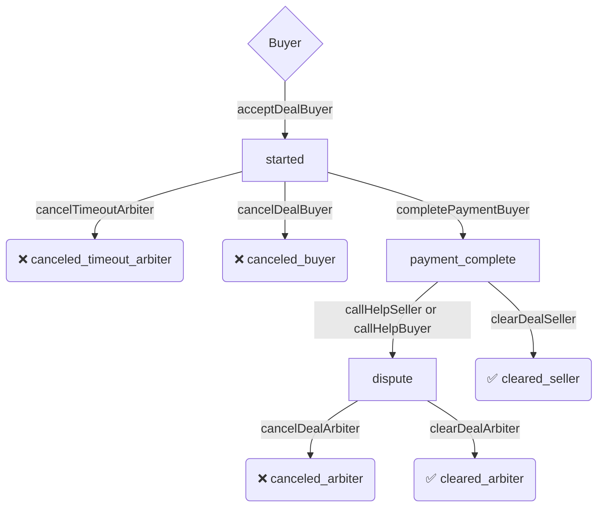

# README

## Флоу по диспуту
* Участник сделки заходит на страницу сделки
* На странице сделки нажимает кнопку Открыть диспут
* Всплывает Метамаск
* В Метамаске участник подписывает начало диспута
* В блокчейн уходит сообщение и изменяет статус диспута
* Следилка ловит это изменение и посылает сигнал в кролика
* Сигнал ловит бакенд и изменяет статус сделки в базе а также уведомляет арбитра
* Арбитр заходит на страницу сделки под своим логином
* Начинает переписку с участниками и выясняет обстоятельства
* Арбитр нажимает кнопку cancel или clear
* У Арбитр всплывает metamask
* Арбитр подписывает команду в metamask
* Изменение статуса уходит в контракт по сделке
* Следилка ловит изменения сделки и отправляет сигнал в кролика
* БАкенд ловит сигнал и изменяет статус сделки в базе

## Staging

* http://172.16.0.70:9771/swagger

## Статусы сделки

